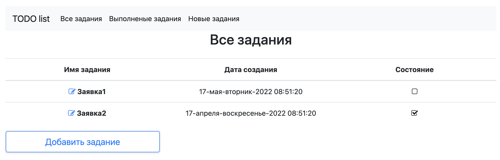
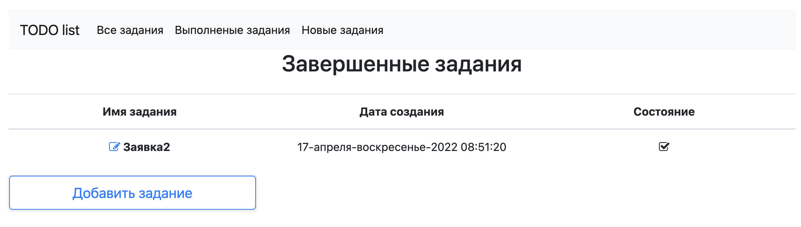
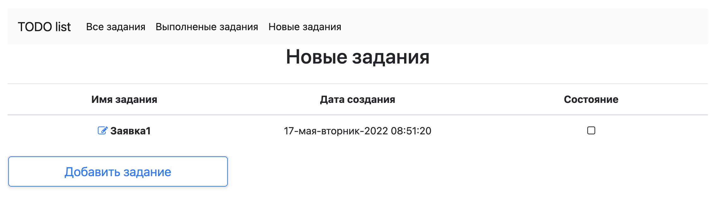
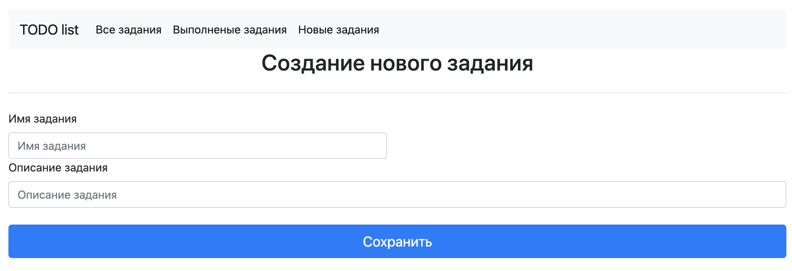
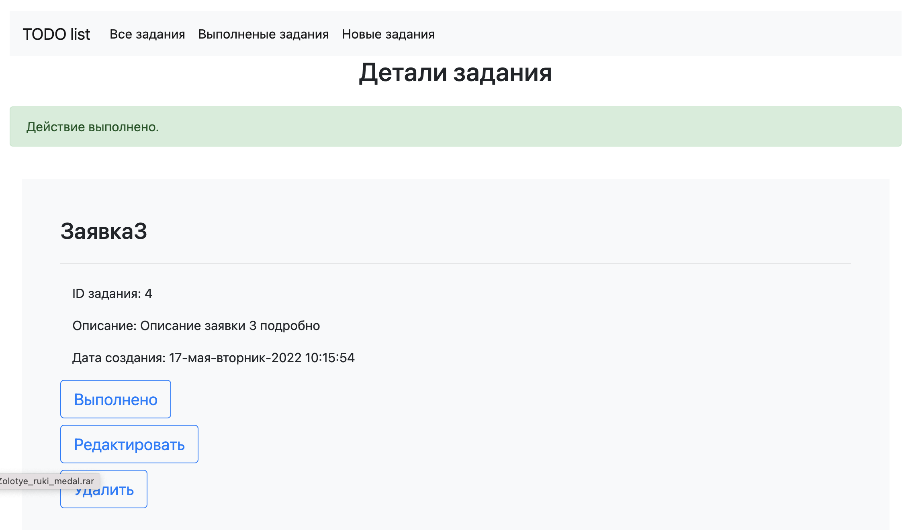
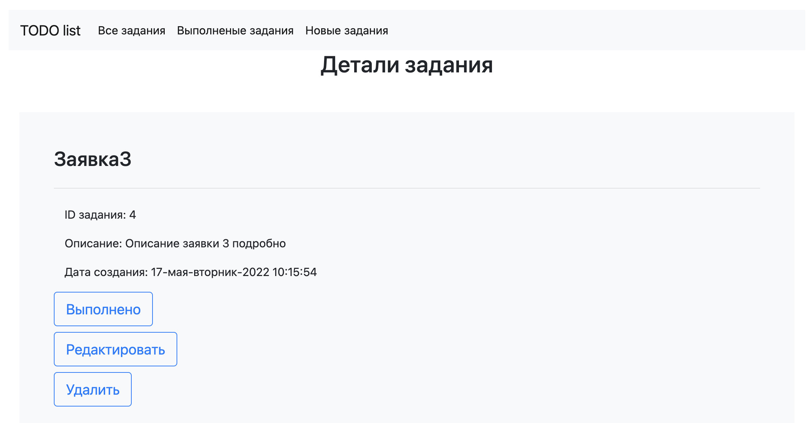
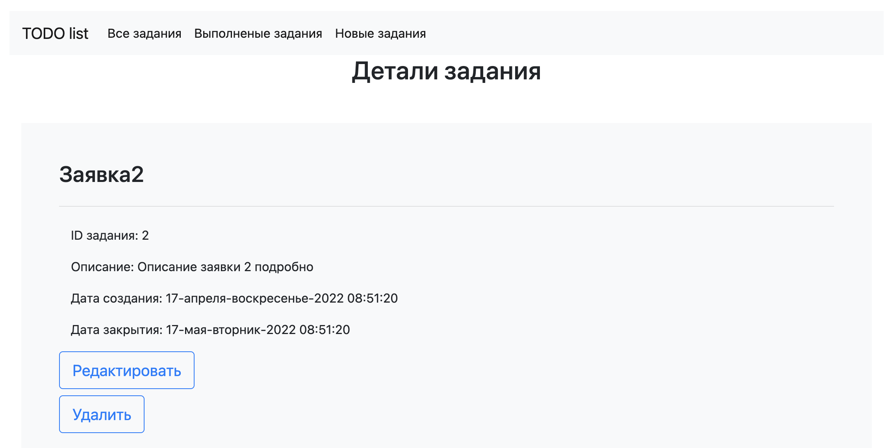

<h2> TODO list </h2>
1. Общий вид главной страницы. Отображаются все задания. Первый столбец отображает имя задания, второй дату создания,  
   третий состояние если галочка установлена - задача закрыта, если галочки нет - задача открыта.  

  

2. Вкладка выполненные задания отображает завершенные задания.  

  

3. Вкладка новые задания отображает не завершенные задания.  

  

4. При нажатии на кнопку "Добавить задание", открывается страница для заполнения полей нового задания.  

  

После нажатия кнопки сохранить отображаются детали нового задания.   
Так же отображается статус успешного выполнения задания.  

  

5. На главной странице, а так же на вкладках выполненных и новых заданий,  
   перед названием задачи расположена активная ссылка в виде "листа с карандашом".  
   При переходе по ссылке открывается форма с полным описанием задания.  
   При этом если задание не завершено то отображается три кнопки, Выполнено, Редактировать, Удалить.  

  

Если задание завершено отображается только две кнопки. Редактировать и Удалить  

  

6. При нажатии на кнопку редактировать открывается форма для редактирования задачи.  
   При этом в активных полях записаны текущие значения.  
   
7. После редактирования и нажатия кнопки сохранить, открывается форма с детализацией задачи  
   и отображением успешного статуса изменения.  
   У всех отредактированных задач время создания меняется на время редактирования.  

8. При нажатии кнопки выполнено задаче присваивается время завершения.  
   И задача переходит в статус завершенной.  

9. При нажатии на кнопку удалить, задача удаляется и открывается главная страница,  
    при этом отражается статус успешного выполнения задачи.  
   